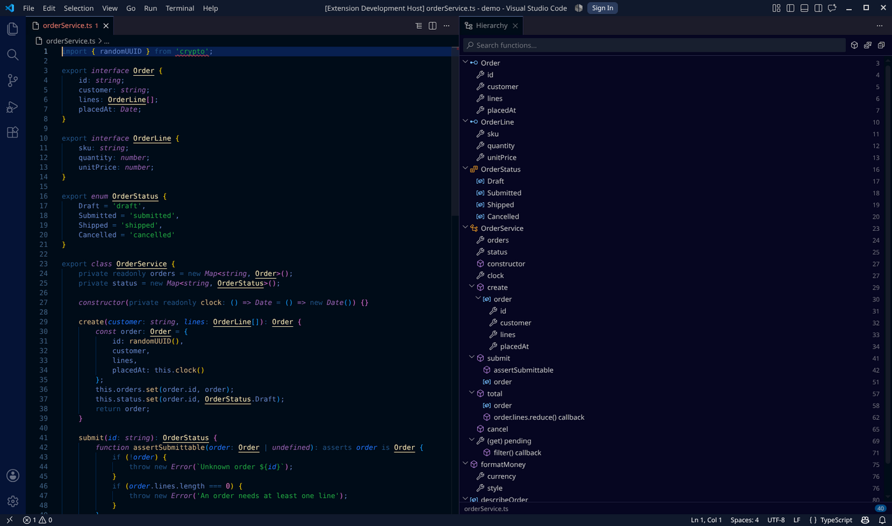
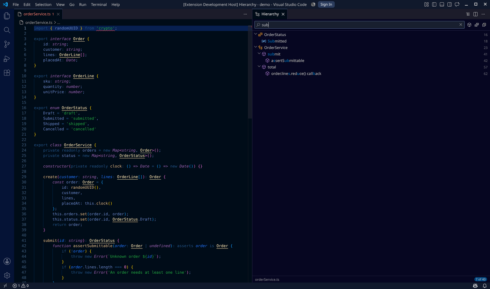

# Code Hierarchy

A live outline of your code, docked **beside the editor** rather than hidden in
the activity bar. It opens with your file, follows your cursor, rebuilds as you
type, and has a fuzzy search box for jumping to any function.



## Why it is not a sidebar

The panel is a tab in the editor area, so it sits next to your code instead of
competing with the file explorer. It opens on its own the first time you focus a
source file in a window, and stays where you put it. There is no icon to click
and no view to go hunting for.

If you would rather open it yourself, set `codeHierarchy.autoOpen` to `false`
and use **Code Hierarchy: Open Hierarchy Panel**, the `{}` button in the editor
title bar, or <kbd>Ctrl</kbd>+<kbd>Alt</kbd>+<kbd>H</kbd>.

## Search

Type in the box at the top and the tree narrows as you go. Matching is a
subsequence match, the same idea as Go to Symbol: `os` finds `OrderService`,
`sub` finds `submit` and `assertSubmittable`. Matched characters are
highlighted, results are ranked by how well they matched, and parents are kept
so a nested hit stays reachable.



<kbd>Ctrl</kbd>+<kbd>Alt</kbd>+<kbd>H</kbd> jumps straight to the search box
from anywhere. <kbd>Down</kbd> moves from the box into the results,
<kbd>Enter</kbd> jumps to the symbol, <kbd>Esc</kbd> clears the search.

## What else it does

- **Hierarchy, not a flat list.** Methods sit under their class, nested closures
  under the function that defines them.
- **Click to jump.** The cursor moves and the symbol's body flashes. Focus stays
  in the panel so you can keep browsing.
- **Follows your cursor.** Move around the file and the enclosing symbol is
  highlighted, expanding its parents if needed.
- **Rebuilds as you type**, debounced so it never fights your editing.
- **Breadcrumb in the status bar** showing the enclosing symbol path.
- **Functions only.** One toolbar click hides fields, properties and variables,
  and drops containers left with nothing callable inside.
- **Sort** by file position or by name.
- **Keyboard navigable** throughout, with arrow keys, `Enter` and `Esc`.
- **Works without a language server.** If a file's language has no extension
  installed, a built-in pattern parser produces an approximate tree instead of
  showing nothing. Those results are labelled *approximate* in the footer.

## Language support

Exact hierarchies come from whatever language server is installed for the file.
The extension asks VS Code for document symbols, so anything with a working
Outline view works here too: TypeScript, JavaScript, Python, Go, Rust, Java,
C/C++, C#, PHP, Ruby, JSON, Markdown, and so on.

The fallback parser covers Python (indentation based) and brace languages
(TypeScript, JavaScript, Java, C, C++, C#, Go, Rust, Swift, PHP, shell), picking
up `class`/`struct`/`interface`/`impl`/`namespace`, `type X struct`, `def`,
`func`, `fn`, `function`, arrow-function constants, and typed method
declarations including the brace-on-next-line style.

## Commands

| Command | Default key | What it does |
| --- | --- | --- |
| `Code Hierarchy: Search Functions` | <kbd>Ctrl</kbd>+<kbd>Alt</kbd>+<kbd>H</kbd> | Open the panel and focus the search box |
| `Code Hierarchy: Open Hierarchy Panel` | | Open the panel beside the editor |
| `Code Hierarchy: Refresh` | | Rebuild the hierarchy now |
| `Code Hierarchy: Toggle Follow Cursor` | | Stop or resume cursor tracking |
| `Code Hierarchy: Show Log` | | Open the extension's output channel |

## Settings

| Setting | Default | Meaning |
| --- | --- | --- |
| `codeHierarchy.autoOpen` | `true` | Open the panel automatically on the first source file |
| `codeHierarchy.followCursor` | `true` | Highlight the symbol under the cursor |
| `codeHierarchy.functionsOnly` | `false` | Start in functions-only mode |
| `codeHierarchy.sortOrder` | `position` | `position` or `name` |
| `codeHierarchy.showDetail` | `true` | Show the signature detail from the language server |
| `codeHierarchy.showLineNumbers` | `false` | Show each symbol's line number |
| `codeHierarchy.refreshDelay` | `400` | Debounce in ms after you stop typing |
| `codeHierarchy.useFallbackParser` | `true` | Use the pattern parser when no language server answers |
| `codeHierarchy.showStatusBar` | `true` | Show the enclosing-symbol breadcrumb |
| `codeHierarchy.highlightOnReveal` | `true` | Flash the symbol body when you click it |

## Troubleshooting

Open **Output -> Code Hierarchy** (or run `Code Hierarchy: Show Log`) for a
timestamped log of every rebuild, how long it took, and whether the fallback
parser was used. The log level picker in that view turns on trace output.

If a file shows *approximate* in the footer when you expect exact results, the
language for that file has no server installed or it has not finished starting.
Installing the matching language extension is the fix; the panel switches to
exact results on the next rebuild.

## Developing

```bash
npm install
npm run watch              # esbuild, rebuilds dist/ on change
npm test                   # types + lint + unit tests
npm run test:integration   # runs a real VS Code and drives the extension
```

Press <kbd>F5</kbd> to launch an Extension Development Host with the extension
loaded, then open any source file.

### Scripts

| Script | What it does |
| --- | --- |
| `npm run build` | Production bundles into `dist/` (minified, no sourcemaps) |
| `npm run compile` | Development bundles into `dist/` |
| `npm run watch` | Development bundles, rebuilt on change |
| `npm run check-types` | `tsc --noEmit` over the host and webview projects |
| `npm run lint` | ESLint with type-aware rules |
| `npm run test:unit` | Parser, search and shaping tests under plain Node |
| `npm run test:integration` | Mocha suite inside a downloaded VS Code |
| `npm test` | Types, lint, and unit tests |
| `npm run test:all` | The above plus integration tests |
| `npm run package` | Builds and produces a `.vsix` |

On Linux the integration tests need a display; use
`xvfb-run -a npm run test:integration` on a headless machine.

### Tests

Unit tests run outside VS Code by intercepting `require('vscode')` with a small
stub (`test/unit/mock-vscode.js`), which keeps the parser, search and shaping
logic fast to iterate on. Integration tests run inside a real VS Code downloaded
by `@vscode/test-cli`, and assert against the actual built-in TypeScript
language server, the fallback path for a language with no server, and the panel
rebuilding after a live document edit.

### Layout

| File | Role |
| --- | --- |
| `src/extension.ts` | Activation, commands, editor listeners, status bar |
| `src/panel.ts` | The webview panel docked beside the editor |
| `src/webview/main.ts` | Panel UI: rendering, search, keyboard navigation |
| `src/webview/style.css` | Panel styling, driven entirely by theme variables |
| `src/shape.ts` | Fuzzy match, filtering and sorting (no `vscode` import) |
| `src/symbols.ts` | Asks VS Code for document symbols, with retry and fallback |
| `src/fallback.ts` | Pattern parser used when no language server answers |
| `src/model.ts` | The `SymbolNode` shape and tree helpers |
| `src/icons.ts` | `SymbolKind` to codicon mapping |
| `src/log.ts` | Output channel logging |
| `src/test/integration/` | Mocha suite that runs inside VS Code |
| `test/unit/` | Node tests that stub the `vscode` module |

## Privacy and permissions

The extension reads open documents and asks VS Code for their symbols. It makes
no network requests, runs no workspace code, and collects no telemetry. The
panel's content security policy blocks every remote resource. It declares
support for [restricted mode](https://code.visualstudio.com/docs/editor/workspace-trust)
and virtual workspaces, so it keeps working in both.

## Publishing to the Marketplace

One field in `package.json` is still a placeholder: `publisher` is `keyur`, and
it must match the publisher ID created at
<https://marketplace.visualstudio.com/manage> or `vsce publish` will reject it.
Changing it also changes the extension ID, so update `EXTENSION_ID` in
`src/test/integration/extension.test.ts` to match.

```bash
npm run test:all
npx vsce publish
```

Releases are built by CI on every push; the packaged `.vsix` is attached to each
GitHub release.

## Licence

MIT. The codicon font shipped in `dist/` is Microsoft's, also MIT.
